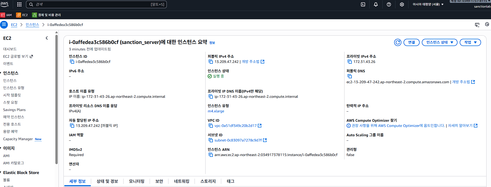

# OpenSanctions 서버 운영 매뉴얼
## AWS EC2 서버 정보



## 🐋 Docker 설치 및 초기 설정
```bash
sudo apt update && sudo apt upgrade -y
sudo apt install -y ca-certificates curl gnupg lsb-release
sudo mkdir -p /etc/apt/keyrings
curl -fsSL https://download.docker.com/linux/ubuntu/gpg | sudo gpg --dearmor -o /etc/apt/keyrings/docker.gpg
echo "deb [arch=$(dpkg --print-architecture) signed-by=/etc/apt/keyrings/docker.gpg] https://download.docker.com/linux/ubuntu $(lsb_release -cs) stable" | sudo tee /etc/apt/sources.list.d/docker.list > /dev/null
sudo apt update
sudo apt install -y docker-ce docker-ce-cli containerd.io docker-buildx-plugin docker-compose-plugin
sudo systemctl enable docker && sudo systemctl start docker
docker --version
docker compose version
sudo usermod -aG docker $USER
```
**설명:** Docker 공식 리포지토리 등록 및 설치.

---

## 🐘 PostgreSQL 설치 및 설정
```bash
sudo apt install -y postgresql postgresql-contrib
sudo systemctl enable postgresql && sudo systemctl start postgresql
sudo -i -u postgres
sudo vi /etc/postgresql/16/main/postgresql.conf
sudo vi /etc/postgresql/16/main/pg_hba.conf
sudo systemctl restart postgresql
```
**설명:** PostgreSQL 16 설치 및 원격 접속 설정.
### postgres / star##!!5836 으로 접속


---

## 📂 FTP 서버 (vsftpd) 구성
```bash
sudo apt install -y vsftpd
sudo systemctl enable vsftpd && sudo systemctl start vsftpd
sudo adduser ftpuser
sudo mkdir -p /home/ftpuser/ftp/upload
sudo chown nobody:nogroup /home/ftpuser/ftp
sudo chmod a-w /home/ftpuser/ftp
sudo chown ftpuser:ftpuser /home/ftpuser/ftp/upload
sudo vi /etc/vsftpd.conf
sudo systemctl restart vsftpd
```
**설명:** FTP 업로드 전용 사용자 및 디렉토리 구성.
### ftpuser / star##!!5836 으로 접속

---

## 📦 OpenSanctions (Docker Compose 실행)
```bash
sudo unzip opensanctions2.zip
vi .env
vi docker-compose.yml
sudo docker compose up -d --build
docker logs -f upload-zavod-1
```
**설명:** OpenSanctions 환경 변수 수정 후 컨테이너 실행.

---

## 🧠 Node.js 및 tmux 설치
```bash
curl -fsSL https://deb.nodesource.com/setup_20.x | sudo -E bash -
sudo apt install -y nodejs tmux
node -v && npm -v
tmux
```
**설명:** Node.js 20.x 및 tmux 설치.

---

## 🐍 Python 및 psycopg2 설정
```bash
sudo apt install -y python3 python3-pip python3-venv python3-psycopg2
python3 -m venv venv
source venv/bin/activate
pip install psycopg2-binary
python3 -c "import psycopg2; print('✅ psycopg2 OK')"
```
**설명:** Python 가상환경 구성 및 DB 라이브러리 설치.

---

## 🕒 Crontab 자동화
```bash
crontab -e
0 2 * * * /usr/bin/python3 /home/ftpuser/ftp/upload/ui/load.py >> /home/ftpuser/ftp/upload/entity_batch.log 2>&1
crontab -l
sudo systemctl status cron
```
**설명:** ETL 스크립트(load.py) 자동 실행.

---

## 💾 EBS 디스크 확장
```bash
sudo apt install -y cloud-guest-utils
sudo growpart /dev/xvda 1
sudo resize2fs /dev/xvda1
df -h
```
**설명:** AWS EC2 EBS 볼륨 확장 및 파일시스템 확장.

---

## 🪶 로그/검증 명령
```bash
docker ps -a
docker image ls
docker logs -f --tail 50 upload-zavod-1
tail -n 20 /home/ftpuser/ftp/upload/entity_batch.log
df -h
lsblk
```

---

## ✅ 핵심 흐름 요약
| 단계 | 목적 | 주요 명령 |
|------|------|-----------|
| 1 | 시스템 초기 업데이트 | `apt update`, `apt upgrade` |
| 2 | Docker 설치 및 Compose 구성 | `docker compose up -d --build` |
| 3 | PostgreSQL 설치 및 설정 | `vi postgresql.conf`, `pg_hba.conf` |
| 4 | FTP 업로드 환경 구성 | `/home/ftpuser/ftp/upload` 생성 |
| 5 | OpenSanctions 컨테이너 실행 | `upload-zavod-1` |
| 6 | Python ETL 배치 구성 | `load.py`, `cron` 등록 |
| 7 | 디스크 용량 확장 | `growpart`, `resize2fs` |
| 8 | 운영 점검 | `docker logs`, `df -h`, `tail` |
