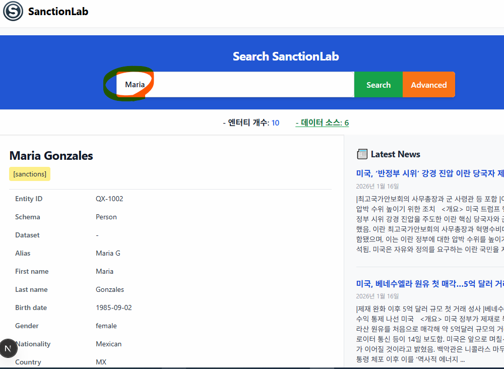

# 🧭 OpenSanctions Repository Overview

## 🎯 Purpose
**OpenSanctions**는 전 세계의 제재(Sanctions) 및 KYC/AML 관련 데이터를 수집·정제·표준화하여,  
서로 다른 국가나 기관의 데이터라도 **일관된 FollowTheMoney 엔터티(Entity)** 구조로 표현되도록 만드는 프로젝트입니다.  
이렇게 구조화된 데이터는 **데이터 분석**, **공유**, **컴플라이언스 검증(KYC/AML)** 등에 활용됩니다.

---

## 📁 Repository Structure

### `zavod/`
- **핵심 ETL 프레임워크**
- 크롤러(crawler)를 위한 메타데이터 모델, 엔터티 추상화, 컨텍스트 헬퍼를 정의
- `zavod`라는 Python 패키지로 배포되며, CLI 명령어(`zavod crawl`) 제공

> 예: `zavod crawl datasets/us/ofac.yml`

---

### `datasets/`
- 각 제재 소스별 YAML 정의 파일과 선택적 Python 크롤러 코드 포함  
- 실행 명령: `zavod crawl <dataset.yml>`  
- 수행 결과:
  - 원본 데이터 다운로드
  - 엄격한 파싱(모호한 경우 실패)
  - 출력: `data/datasets/<dataset명>/`
- **lookup** 파일로 잘못된 값 수동 정정 가능

---

### `contrib/`
- 운영/QA용 보조 스크립트 포함  
- 예: `aggregate_issues.py` — 크롤링 중 발생한 이슈를 통합 검토용으로 집계

---

### `analysis/`
- 데이터 품질 및 제재 프로그램 범위를 분석하는 SQL 스니펫과 리서치 노트 포함  
- 예: 제재 기관별/프로그램별 데이터 조인 및 통계 검토 쿼리

---

### `ui/`
- **Next.js 기반 데이터 검토 및 편집 UI**
- 주요 기술:
  - React 18
  - Bootstrap 스타일
  - CodeMirror 에디터
  - `@opensanctions/followthemoney` 통합
- 역할: 크롤링 결과 검토 및 수정 인터페이스 제공

---

### `Dockerfile`
- Ubuntu 24.04 기반 멀티 스테이지 빌드  
- `zavod` 패키지 설치 및 Poppler, LevelDB 등 의존성 설정  
- 기본 실행 명령어: `zavod`

---

### `docker-compose.yml`
- 대부분의 데이터셋을 자동으로 **ETL 일괄 처리**  
- 특정 내부/대용량 데이터셋은 제외  
- 실패한 데이터셋은 `failed_datasets.md`에 기록

---

## 🐳 로컬 Docker 실행 (PostgreSQL 포함)

로컬 Docker 환경에서는 `docker-compose.yml`이 PostgreSQL과 UI를 함께 띄우도록 구성되어 있습니다.  
`.env`의 `POSTGRES_*` 값을 필요에 따라 변경한 뒤 아래 명령으로 실행하세요.

```bash
docker compose up -d db
docker compose run --rm zavod bash -c "export DATABASE_URL=postgresql://postgres:password@db:5432/dev && zavod crawl datasets/nl/terrorism_list/nl_terrorism_list.yml && zavod export datasets/nl/terrorism_list/nl_terrorism_list.yml && zavod load-db datasets/nl/terrorism_list/nl_terrorism_list.yml"
docker compose up -d web
```

UI 접속: http://localhost:3000  
PostgreSQL 접속: localhost:5432

---

### `start.sh` / `start.ps1`
- **통합 실행 스크립트** (Linux/Windows)
- 주요 기능:
  1. 컨테이너 초기화 및 PostgreSQL 시작  
  2. `zavod crawl → export → load-db` 실행  
  3. UI 자동 구동  

---

### `Makefile`
- 프로젝트 관리 명령어 모음  
  ```bash
  make build      # 도커 이미지 빌드
  make shell      # 컨테이너 내부 진입
  make crawl      # 기본 파이프라인 실행
  make clean      # 임시 파일 정리


## DB 설치 후
```Powershell
Get-Content .\opensanctions_schema.sql -Raw | docker exec -i opensanctions3-db-1 psql -U postgres -d dev
```
---
```bash
docker exec -i opensanctions3-db-1 psql -U postgres -d dev < opensanctions_schema.sql
```
## sample data insert
```
Get-Content -Raw .\sample_data_insert.sql | docker exec -i opensanctions3-db-1 psql -U postgres -d dev
```

## 입력 중 오류 시 roll back
```
docker exec -it opensanctions3-db-1 psql -U postgres -d dev -c "ROLLBACK;"
```

## 최종 실습 및 화면 예시


## Chat GPT
https://chatgpt.com/share/6969debb-a8c8-8007-85a1-8c584ad7daa0